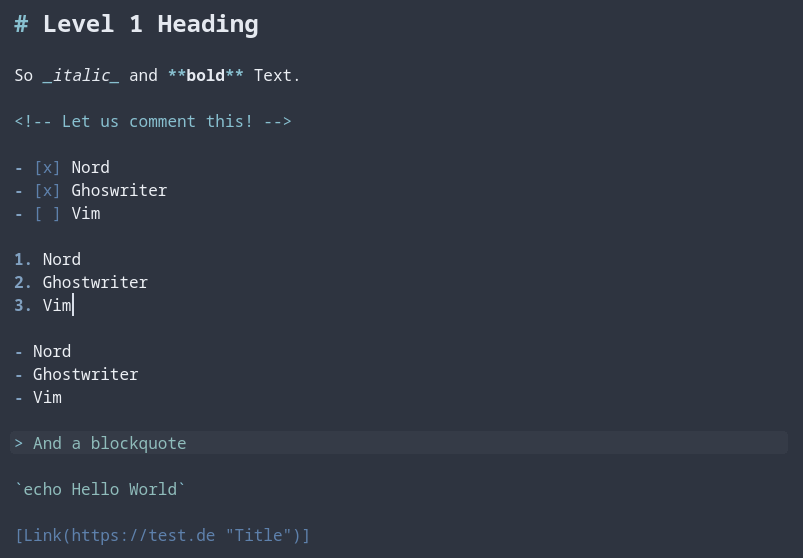
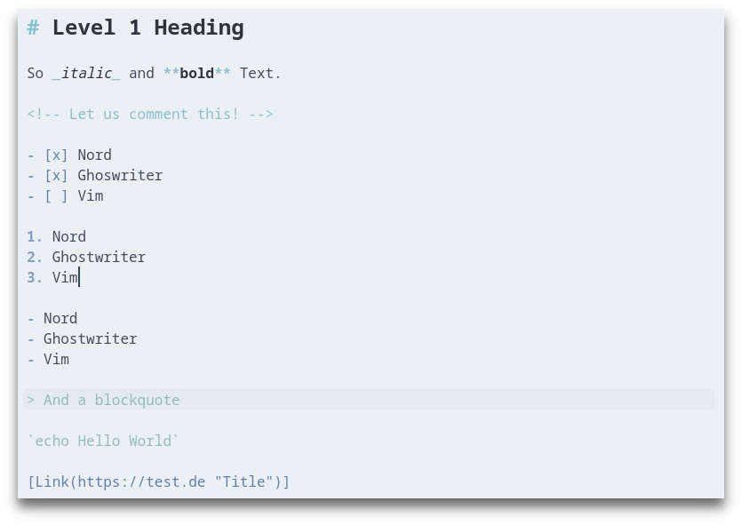

# Nord Ghostwriter
An arctic, north-bluish clean and elegant [Ghostwriter](https://github.com/wereturtle/ghostwriter).

Designed for a fluent and clear workflow based on the [Nord](https://github.com/arcticicestudio/nord) color palette.

## Getting Started

Download the [Nord.json](Nord/Nord.json) into you Ghostwriter Themes folder, which [according to the author](https://github.com/wereturtle/ghostwriter/wiki/Theme-File-Format#file-location) is one of the following:

- **Windows**: `C:\Users<your_user_name>\AppData\Roaming\ghostwriter\themes`
- **Windows portable mode**: `<your_ghostwriter_portable_folder>\data\themes`
- **Linux**: `/home/<your_user_name>/.config/ghostwriter/themes`
- **Mac OS X**: `~/Library/Application Support/ghostwriter/themes`

## Preview

### Dark

### Light

